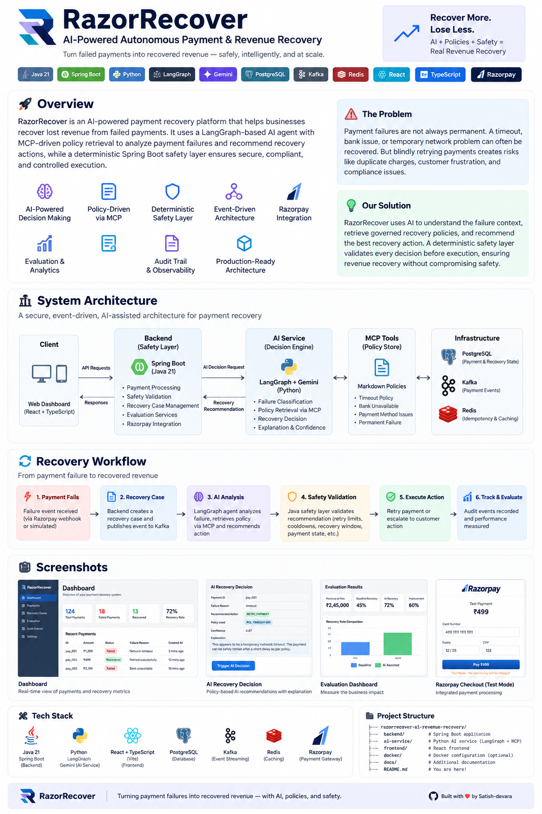
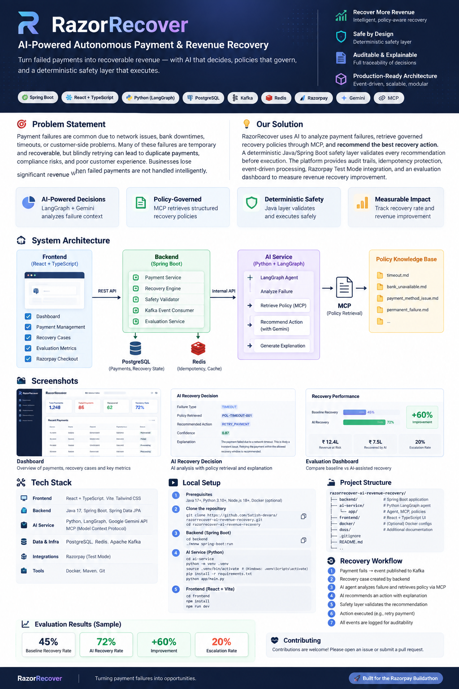
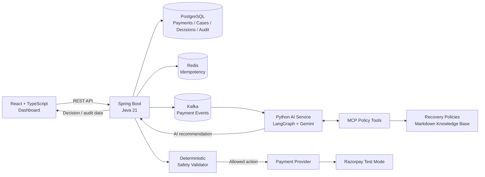
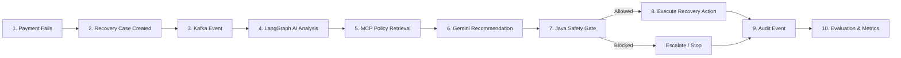
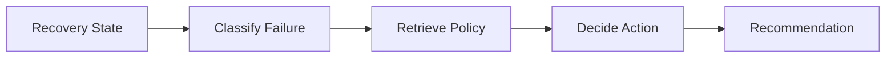
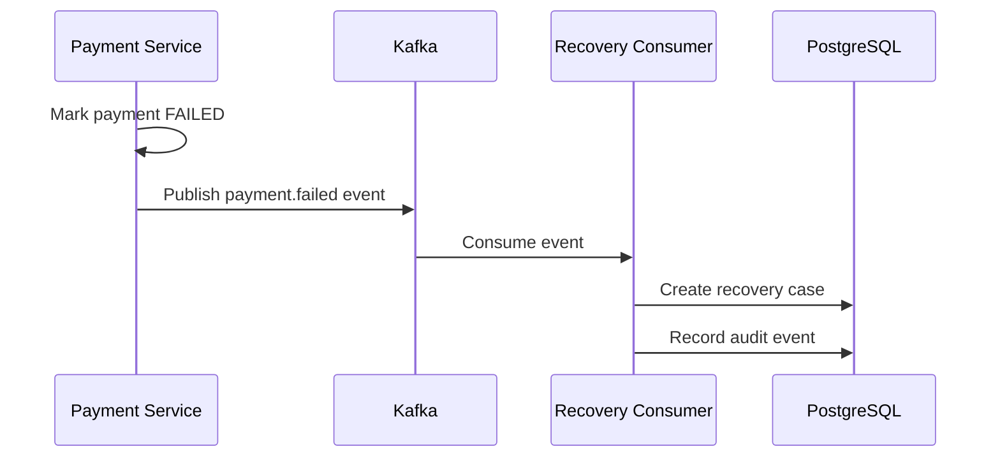
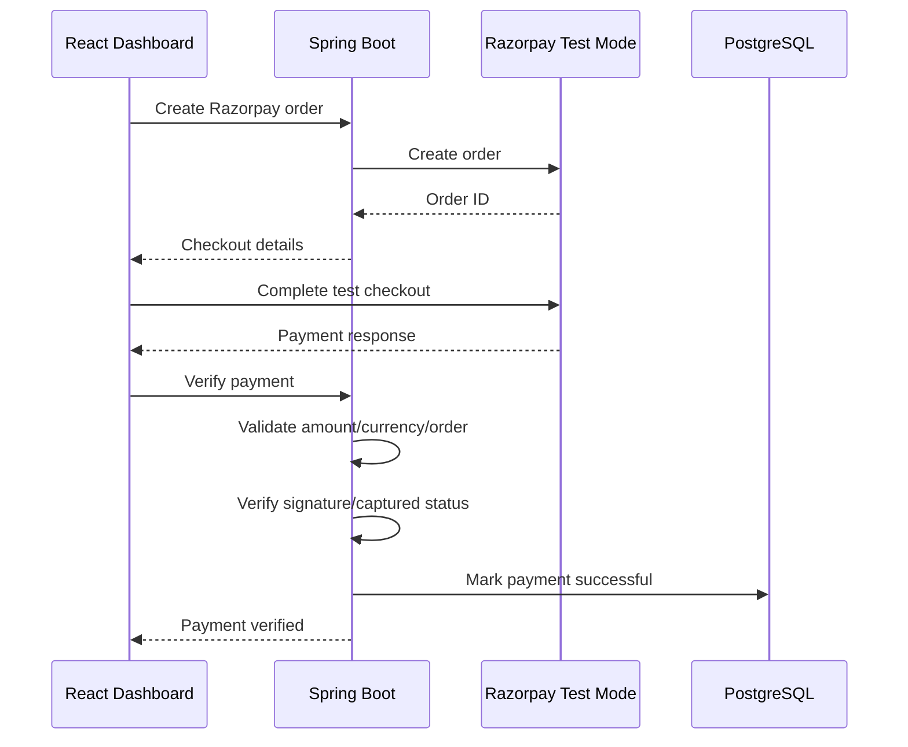

# RazorRecover

<p align="center">
  
</p>

<p align="center">
  <strong>AI-Powered Autonomous Payment & Revenue Recovery</strong><br/>
  Turn failed payments into recoverable revenue — with AI that recommends, policies that govern, and a deterministic safety layer that executes.
</p>

<p align="center">
  
  
  
  
  
  
  
  
  
  
  
</p>

---

## 1. Why RazorRecover?

Payment failures do not always mean lost revenue.

A timeout, temporary network problem, or bank outage may be recoverable. But blindly retrying every failed payment can create duplicate-payment risk, unnecessary customer friction, and unsafe automation.

Traditional rule engines solve only part of the problem:

- They can classify known failure types.
- They can enforce deterministic limits.
- But they are less effective at combining payment context, policy context, explanations, and adaptive recommendations.

**RazorRecover separates intelligence from authority.**

> **AI recommends. MCP retrieves policy. Java enforces safety. The system executes only what is allowed.**

---

## 2. What the Project Solves

RazorRecover provides an end-to-end recovery workflow for failed payments:

1. Detect a failed payment.
2. Create a recovery case.
3. Publish payment events through Kafka.
4. Analyze the failure with a LangGraph agent.
5. Retrieve the applicable recovery policy through MCP.
6. Ask Gemini for a recommended recovery action and explanation.
7. Send the recommendation back to Spring Boot.
8. Validate the recommendation using deterministic safety rules.
9. Execute the permitted action or escalate.
10. Record the decision and audit trail.
11. Measure recovery performance through a reproducible benchmark.

The important design principle is that **the LLM never becomes the final authority over payment mutations**.

---

## 3. Solution at a Glance

| Capability | Implementation |
|---|---|
| Payment processing | Spring Boot + provider abstraction |
| Payment simulation | Deterministic simulation provider |
| Real payment integration | Razorpay Test Mode |
| AI reasoning | Python + LangGraph + Gemini |
| Policy retrieval | MCP tool + Markdown policy knowledge base |
| Safety enforcement | Java/Spring Boot deterministic validator |
| Event processing | Apache Kafka |
| Idempotency | Redis |
| Persistent state | PostgreSQL |
| Frontend | React + TypeScript + Vite + Tailwind CSS |
| Evaluation | Deterministic synthetic recovery benchmark |
| Testing | Spring Boot integration/unit test suite |
| Local infrastructure | Docker Compose |

---

## 4. System Architecture

<p align="center">
  
</p>

### Architecture flow



### Component responsibilities

#### Frontend
React + TypeScript provides:

- Payment dashboard
- Recovery case monitoring
- AI recovery intelligence
- Evaluation metrics
- Razorpay Test Mode checkout
- Recovery timeline and audit visibility

#### Spring Boot backend
The backend is the transactional authority:

- Payment lifecycle
- Recovery case lifecycle
- Recovery engine
- Safety validation
- Provider abstraction
- Kafka producers/consumers
- Redis idempotency
- Audit events
- AI decision acceptance
- Evaluation API
- Razorpay verification

#### AI service
Python handles reasoning rather than payment mutation:

- LangGraph workflow orchestration
- Failure classification
- Policy retrieval
- Gemini recommendation
- Confidence and explanation generation
- Deterministic fallback when Gemini is unavailable

#### MCP policy layer
Recovery rules are exposed as tools instead of being hard-coded into the LLM prompt.

Example policy:

```text
TIMEOUT
    -> RETRY_PAYMENT

BANK_UNAVAILABLE
    -> RETRY_PAYMENT

PAYMENT_METHOD_ISSUE
    -> REQUEST_CUSTOMER_ACTION

INSUFFICIENT_FUNDS
    -> REQUEST_CUSTOMER_ACTION

PERMANENT_FAILURE
    -> ESCALATE
```

---

## 5. Recovery Workflow



### Example: temporary timeout

```text
Payment
   │
   ├── status = FAILED
   ├── failureReason = TIMEOUT
   └── scenario = TIMEOUT
          │
          ▼
Recovery Case
          │
          ▼
LangGraph
          │
          ├── classify_failure()
          │       └── TRANSIENT
          │
          ├── retrieve_recovery_policy()
          │       └── MCP → POL-TIMEOUT-001
          │
          └── decide_recovery_action()
                  └── RETRY_PAYMENT
                          │
                          ▼
                 Java Safety Validator
                          │
                 SAFETY_CHECK_PASSED
                          │
                          ▼
                    Retry Payment
                          │
                          ▼
                      RECOVERED
```

---

## 6. The Safety Model

This is the core architectural decision of RazorRecover.

The AI can **recommend**:

- `RETRY_PAYMENT`
- `REQUEST_CUSTOMER_ACTION`
- `ESCALATE`

But Spring Boot decides whether the recommendation is actually permitted.

### Safety checks

The validator checks:

```text
Is the recovery case already terminal?
        ↓
Is the payment currently FAILED?
        ↓
Is the requested action valid?
        ↓
Have maximum retries been exceeded?
        ↓
Has the recovery window expired?
        ↓
Is a cooldown currently active?
        ↓
SAFETY_CHECK_PASSED
```

This prevents an LLM from:

- Retrying a successful payment
- Retrying indefinitely
- Retrying outside the recovery window
- Ignoring cooldown rules
- Mutating an invalid payment state
- Bypassing terminal-case protection

### Why this matters

Payment recovery is a high-consequence workflow.

The project therefore follows:

> **Probabilistic intelligence + deterministic authorization**

The LLM is useful for reasoning; deterministic code remains responsible for execution safety.

---

## 7. AI Agent Design

The LangGraph workflow is intentionally small and explainable:



### Agent state

The workflow carries context such as:

- Recovery case ID
- Payment ID
- Amount
- Currency
- Failure reason
- Scenario
- Failure category
- Retrieved policy
- Policy ID
- Recommended action
- Confidence
- Reason

### Gemini behavior

Gemini is used for the recommendation and explanation.

The AI response is structured around:

```json
{
  "recommendedAction": "RETRY_PAYMENT",
  "confidence": 0.95,
  "reason": "Transient payment failure detected; retrying within policy limits may recover revenue.",
  "policyId": "POL-TIMEOUT-001"
}
```

### Resilience

External LLM calls can fail or return temporary service errors.

RazorRecover therefore:

1. Retries the Gemini request.
2. Falls back to deterministic policy logic if the model remains unavailable.
3. Still sends the recommendation through the Java safety layer.

This means **AI availability does not become payment-safety availability**.

---

## 8. MCP Policy Retrieval

RazorRecover uses MCP to expose recovery-policy functionality as tools.

The MCP server provides tools such as:

```text
get_recovery_policy(failure_reason)
get_payment_context(...)
```

The policy tool maps failure types to governed policy documents:

```text
app/policies/
├── timeout.md
├── bank_unavailable.md
├── payment_method_issue.md
└── permanent_failure.md
```

A policy contains information such as:

- Policy ID
- Recommended recovery action
- Maximum retries
- Cooldown
- Recovery window
- Restrictions
- Terminal conditions

### Important implementation note

The current policy retrieval is a **lightweight knowledge-base retrieval approach using Markdown policy documents**, exposed through MCP. It is intentionally deterministic and does not claim vector-embedding retrieval.

---

## 9. Event-Driven Processing

Kafka decouples payment failure events from recovery-case creation.



This allows payment processing and recovery processing to evolve independently.

---

## 10. Idempotency & Duplicate Protection

Redis provides an idempotency mechanism for operations such as AI recovery decisions.

The backend also protects recovery execution through state-aware validation:

- Payment must be in an eligible state.
- Recovery cases have terminal states.
- Retry counts are bounded.
- Cooldowns are enforced.
- Recovery windows are enforced.

This combination reduces the risk of duplicate or repeated recovery actions.

---

## 11. Razorpay Test Mode

RazorRecover includes a payment-provider abstraction:

```text
PaymentProvider
       │
       ├── SimulationPaymentProvider
       │
       └── RazorpayPaymentProvider
```

This allows the same recovery engine to work with deterministic local scenarios and Razorpay Test Mode.

### Test Mode flow



The application verifies the payment server-side before updating internal payment state.

---

## 12. Evaluation

The project includes a deterministic synthetic benchmark to compare a baseline recovery strategy with AI-assisted recovery.

Example dashboard result:

| Metric | Result |
|---|---:|
| Benchmark dataset | 1,000 synthetic failed payments |
| Baseline recovery rate | 45% |
| AI-assisted recovery rate | 72% |
| Recovery improvement | +60% |
| Escalation rate | 20% |

### Important

These metrics are **synthetic benchmark results**, not production payment data.

The benchmark is deterministic so that the same configuration produces reproducible results during a demo.

The purpose is to demonstrate how the platform can quantify recovery lift rather than to claim real-world production performance.

---

## 13. Dashboard

The dashboard brings the complete recovery loop into one interface.

### Main views

- Revenue at risk
- Recovered revenue
- Recovery rate
- Total payments
- Recovery cases
- AI recommendation
- Retrieved policy
- Safety gate result
- Final action
- Recovery outcome
- Audit timeline
- Evaluation benchmark
- Razorpay Test Mode checkout

A typical successful recovery is represented as:

```text
AI Recommendation
        ↓
RETRY_PAYMENT
        ↓
Safety Gate
        ↓
SAFETY_CHECK_PASSED
        ↓
Final Action
        ↓
RETRY_PAYMENT
        ↓
Outcome
        ↓
RECOVERED
```

---

## 14. API Surface

### Payments

```http
POST /api/payments
GET  /api/payments
GET  /api/payments/{paymentId}

POST /api/payments/{paymentId}/simulate-failure
POST /api/payments/{paymentId}/retries
GET  /api/payments/{paymentId}/attempts
```

### Recovery cases

```http
POST /api/recovery-cases
GET  /api/recovery-cases
GET  /api/recovery-cases/{recoveryCaseId}

GET  /api/recovery-cases/{recoveryCaseId}/decisions
GET  /api/recovery-cases/{recoveryCaseId}/audit-events

POST /api/recovery-cases/{recoveryCaseId}/evaluate
POST /api/recovery-cases/{recoveryCaseId}/ai-decision
```

### AI service

```http
GET  /health
POST /agent/evaluate
POST /agent/recover
```

### Evaluation

```http
GET /api/evaluation
```

---

## 15. Data Model

The backend persists the recovery lifecycle in PostgreSQL.

```text
Merchant
   │
   └── Customer
          │
          └── Payment
                 │
                 ├── PaymentAttempt
                 │
                 └── RecoveryCase
                         │
                         ├── RecoveryDecision
                         │
                         └── AuditEvent

RecoveryPolicy
ExperimentRun
Notification
```

Key entities include:

- `Payment`
- `PaymentAttempt`
- `RecoveryCase`
- `RecoveryDecision`
- `RecoveryPolicy`
- `AuditEvent`
- `ExperimentRun`
- `Notification`
- `Customer`
- `Merchant`

---

## 16. Local Setup

### Prerequisites

- Java 21
- Maven / Maven Wrapper
- Python 3.12+
- Node.js 18+
- npm
- Docker Desktop
- A Gemini API key for live AI decisions
- Razorpay Test Mode credentials for checkout testing

### 1. Clone

```bash
git clone https://github.com/Satish-devara/razorrecover-ai-revenue-recovery.git
cd razorrecover-ai-revenue-recovery
```

### 2. Start infrastructure

The root `docker-compose.yml` starts:

```text
PostgreSQL
Redis
Kafka
```

Run:

```bash
docker compose up -d
```

Verify:

```bash
docker compose ps
```

### 3. Backend

```bash
cd backend
./mvnw spring-boot:run
```

The backend runs on:

```text
http://localhost:8080
```

### 4. AI service

```bash
cd ../ai-service

python3 -m venv .venv
source .venv/bin/activate

pip install -r requirements.txt
```

Create `ai-service/.env`:

```env
GEMINI_API_KEY=your_gemini_api_key
GEMINI_MODEL=gemini-3.8-flash
BACKEND_URL=http://localhost:8080
```

Start:

```bash
uvicorn app.main:app --reload --port 8000
```

The AI service runs on:

```text
http://localhost:8000
```

Health check:

```bash
curl http://localhost:8000/health
```

### 5. Frontend

```bash
cd ../frontend
npm install
npm run dev
```

The Vite development server will display its local URL in the terminal.

---

## 17. Environment Variables

### Backend

Configure the backend with your local PostgreSQL, Redis, Kafka and Razorpay Test Mode values.

Example local infrastructure:

```env
POSTGRES_DB=razorrecover
POSTGRES_USER=razorrecover
POSTGRES_PASSWORD=razorrecover_dev
POSTGRES_PORT=5433

RECOVERY_COOLDOWN=0s
```

### AI service

```env
GEMINI_API_KEY=<your-secret>
GEMINI_MODEL=gemini-3.8-flash
BACKEND_URL=http://localhost:8080
```

**Never commit real API keys or secrets.**

The repository intentionally ignores local `.env` files and Python virtual environments.

---

## 18. Testing

Backend tests:

```bash
cd backend
./mvnw test
```

The project includes integration coverage around payment and recovery behavior.

Frontend production build:

```bash
cd frontend
npm run build
```

---

## 19. Project Structure

```text
razorrecover-ai-revenue-recovery/
│
├── backend/
│   └── src/main/java/com/razorrecover/
│       ├── domain/
│       ├── dto/
│       ├── event/
│       ├── evaluation/
│       ├── payment/
│       └── recovery/
│
├── ai-service/
│   ├── app/
│   │   ├── agent/
│   │   │   ├── graph.py
│   │   │   ├── nodes.py
│   │   │   ├── policy_retriever.py
│   │   │   └── state.py
│   │   ├── mcp/
│   │   │   └── server.py
│   │   ├── policies/
│   │   └── main.py
│   ├── requirements.txt
│   └── .gitignore
│
├── frontend/
│   ├── src/
│   │   ├── App.tsx
│   │   ├── api.ts
│   │   └── components/
│   ├── package.json
│   └── vite.config.ts
│
├── docs/
│   └── images/
│
├── docker-compose.yml
└── README.md
```

---

## 20. Design Decisions

### Why AI?

AI is used where contextual reasoning and explanation are useful.

It is **not** used to enforce hard safety constraints.

### Why MCP?

MCP provides a clean tool boundary for exposing recovery-policy knowledge to the AI workflow.

Policies can evolve independently of the model's reasoning logic.

### Why LangGraph?

The recovery workflow is naturally represented as explicit steps:

```text
Classify → Retrieve Policy → Decide
```

LangGraph makes that orchestration visible and extensible.

### Why Spring Boot?

Payment state, recovery state, safety validation, persistence, event processing and provider execution require deterministic transactional behavior.

### Why Kafka?

Payment failure events should be decoupled from downstream recovery processing.

### Why Redis?

Recovery decisions need idempotency protection, and Redis provides a simple low-latency mechanism for that purpose.

### Why Razorpay Test Mode?

It demonstrates that the platform can connect the recovery architecture to an actual payment-provider flow without using real customer money.

---

## 21. Security & Reliability Principles

RazorRecover follows several safety principles:

- **AI is advisory, not authoritative.**
- **Payment mutations remain behind deterministic backend controls.**
- **Retry limits prevent infinite recovery loops.**
- **Cooldowns prevent rapid repeated retries.**
- **Recovery windows prevent stale recovery attempts.**
- **Terminal states cannot be mutated through recovery.**
- **Idempotency reduces duplicate operations.**
- **Audit events preserve decision history.**
- **External AI failures trigger a deterministic fallback.**
- **Secrets are supplied through environment variables rather than source code.**
- **Razorpay payment verification is performed server-side.**

---

## 22. Known Scope & Limitations

This repository is a buildathon implementation designed to demonstrate the architecture and recovery concept.

Current scope intentionally focuses on:

- Safe AI-assisted recovery decisions
- Policy-driven recovery
- Event-driven payment processing
- Test Mode payment integration
- Auditability
- Evaluation

The evaluation benchmark uses synthetic data, and the policy knowledge base currently uses deterministic Markdown retrieval rather than a production vector database.

For a production deployment, additional concerns would include:

- Multi-tenant authorization
- Secrets management
- Distributed tracing
- Production-grade observability
- High-availability infrastructure
- More comprehensive fraud/risk controls
- Expanded payment-provider coverage
- Human approval workflows for selected recovery actions
- Production data-driven model evaluation

---

## 23. Demo Flow

A complete demo can be performed in approximately five minutes:

```text
1. Open RazorRecover dashboard
        ↓
2. Create / simulate a failed payment
        ↓
3. Show the recovery case
        ↓
4. Trigger AI decision
        ↓
5. Show Gemini recommendation
        ↓
6. Show MCP-retrieved policy
        ↓
7. Show Java safety validation
        ↓
8. Show retry + RECOVERED outcome
        ↓
9. Open audit trail
        ↓
10. Run evaluation benchmark
        ↓
11. Demonstrate Razorpay Test Mode
```

### Demo message

> **RazorRecover turns payment failures from lost revenue into safely recoverable revenue — AI recommends, policies govern, and the Java safety layer decides.**

---

## 24. Buildathon Context

RazorRecover was built as an AI-powered payment and revenue recovery platform for the **Razorpay Buildathon**.

The project demonstrates how AI agents can participate in high-consequence financial workflows while keeping execution behind deterministic business and safety controls.

---

## 25. Repository

**GitHub:**  
https://github.com/Satish-devara/razorrecover-ai-revenue-recovery

---

## 26. License

License: TBD.

---

<p align="center">
  <strong>RazorRecover</strong><br/>
  Recover More. Lose Less.
</p>

<p align="center">
  Built for the Razorpay Buildathon.
</p>
