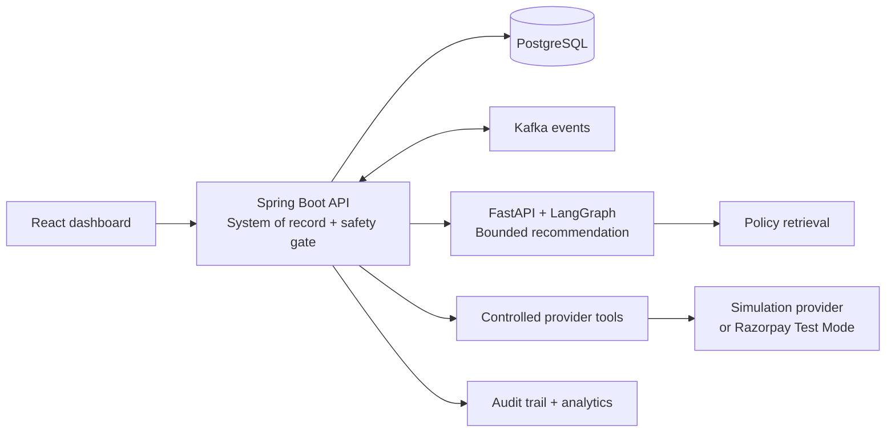

# RazorRecover

RazorRecover is an autonomous, bounded payment-recovery platform for the Razorpay AI Buildathon. It identifies recoverable failed payments, retrieves merchant policy, recommends a constrained action, validates deterministic safety rules, executes through a payment-provider adapter, and records an auditable outcome.

> Status: Phase 2 — Spring Boot persistence foundation. The database schema, JPA domain model, repositories, DTO boundaries, and health endpoint are implemented. Recovery workflows, provider simulation, AI, events, and dashboard are not implemented yet.

## Problem

Payment failures from temporary network and bank issues, timeouts, abandoned attempts, and payment-method problems can leave recoverable revenue behind. Merchants need safe, measurable recovery—not blind retry loops.

## Planned solution

The React dashboard will use Spring Boot as its system of record. A Python FastAPI/LangGraph service will return policy-grounded recovery recommendations. Spring Boot will enforce hard limits before invoking a provider adapter. A deterministic simulator will make the demo reproducible without real money or payment credentials.

## Architecture



See [architecture documentation](docs/architecture.md) for component boundaries and [agent workflow](docs/agent-workflow.md) for the planned controlled state machine.

## Repository layout

```text
frontend/    React dashboard (planned)
backend/     Spring Boot persistence foundation, migrations, and tests
ai-service/  FastAPI/LangGraph agent and tests (planned)
infra/       Reserved for infrastructure-specific configuration
docs/        Product and technical documentation
scripts/     Reproducible local demo and experiment utilities (planned)
```

## Local infrastructure (not started by default)

`docker-compose.yml` defines PostgreSQL, Kafka (KRaft), and Redis for later phases. It does not start containers or pull images by itself.

1. Copy `.env.example` to `.env`.
2. Supply local values; never commit `.env`.
3. After the relevant application services exist, run Docker Compose as documented in the completed setup guide.

No live Razorpay or LLM credentials are required for the planned deterministic simulator.

## Planned documentation

- [Architecture](docs/architecture.md)
- [Agent workflow](docs/agent-workflow.md)
- [Evaluation methodology](docs/evaluation.md)
- [Security boundaries](docs/security.md)

## License

License selection is intentionally deferred until the project owner chooses one.
