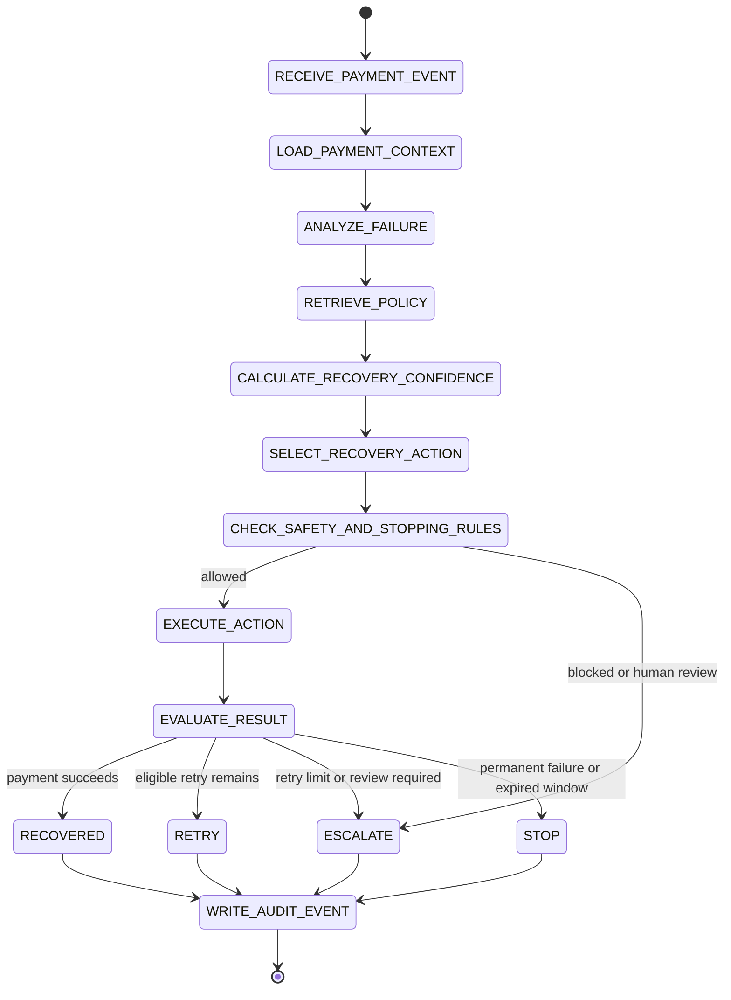

# Agent workflow

## Scope

This is the target workflow for Phase 7, not a currently implemented agent. It is designed around bounded autonomy: the agent recommends; deterministic application code authorizes or rejects actions.

## Planned input and output

The agent input includes a payment failure, relevant customer/payment history, prior recovery attempts, merchant configuration, and retrieved policies. Its output will contain an allowed action candidate, confidence, policy identifiers, and concise evidence. It will never persist a hidden chain-of-thought.

## Deterministic gate

Before a recommendation is executed, Spring Boot will verify all of the following:

- retry count is below a configured maximum;
- payment is inside the recovery window;
- amount is below the automatic-recovery ceiling;
- cooldown is satisfied;
- idempotency key is new;
- action is permitted by merchant and recovery policy;
- action does not alter amount, issue a refund, or exceed provider capability.

Any failed check produces an auditable stop or escalation outcome. The transition graph has no unbounded loop.
