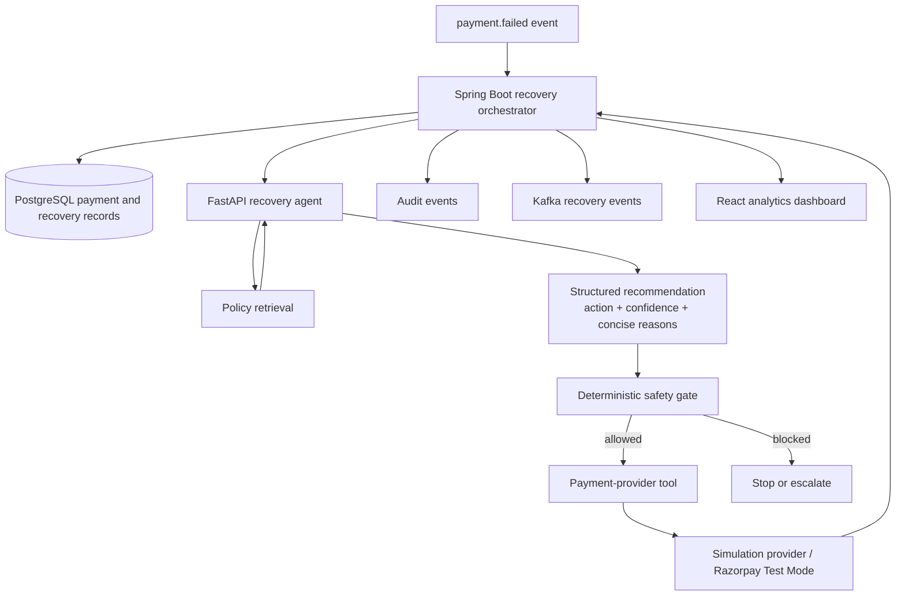

# Architecture

## Purpose

RazorRecover separates AI recommendation from deterministic payment control. The architecture is intentionally designed so that an LLM cannot directly retry, alter, refund, or otherwise manipulate a payment.

## Component responsibilities

| Component | Responsibility | Must not do |
| --- | --- | --- |
| React | Display cases, decisions, experiments, and audits | Execute payment actions |
| Spring Boot | REST API, persistence, safety enforcement, provider adapter, audit trail | Trust an AI action without validation |
| PostgreSQL | Durable payment, decision, policy, and experiment records | Serve as an AI tool endpoint directly |
| Kafka | Publish payment and recovery lifecycle events after the synchronous core works | Become a prerequisite for basic demo reliability |
| FastAPI / LangGraph | Analyze bounded context, retrieve policy, recommend next action | Directly access payment databases or provider credentials |
| Policy retrieval | Return applicable policy snippets and identifiers | Override deterministic limits |
| Provider adapter | Execute a validated retry/status operation | Change payment amount or issue refunds |
| Redis | Later: idempotency, cooldown, and short-lived state | Be the source of truth |

## Interfaces

The planned `PaymentProvider` abstraction will support `getPaymentDetails`, `retryPayment`, and `getPaymentStatus`. `SimulationPaymentProvider` is mandatory for reproducibility. `RazorpayPaymentProvider` is optional and will use Test Mode credentials only.

The agent receives a minimal recovery context and returns a structured recommendation. It is not given database or payment-provider access. The Spring service remains the policy and authorization enforcement point.

## Event lifecycle (planned)

`payment.failed` → `payment.retry.requested` → `payment.retry.completed` → `payment.recovered`, `payment.escalated`, or `payment.stopped`.

Kafka is introduced only after the initial synchronous flow is tested. Each event will carry a correlation ID connecting payment, recovery case, decision, tool call, and audit records.

## Local development infrastructure

Docker Compose defines PostgreSQL 16, Kafka in KRaft mode, and Redis 7. App containers are intentionally absent in Phase 1 because no application artifacts exist yet.
